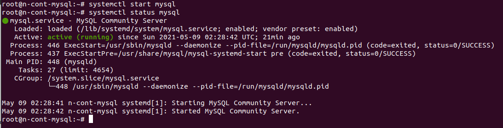
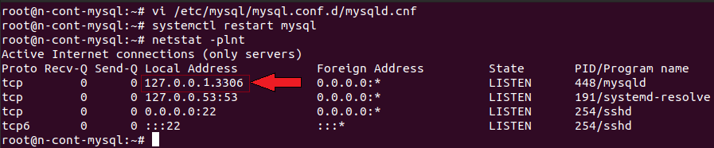
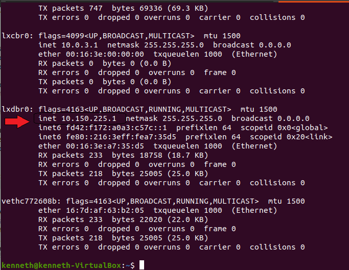
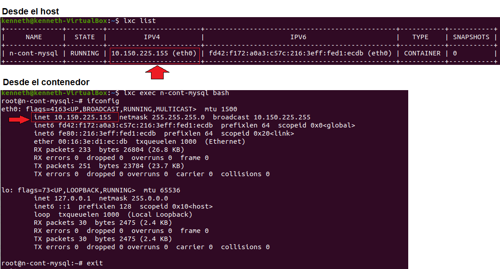
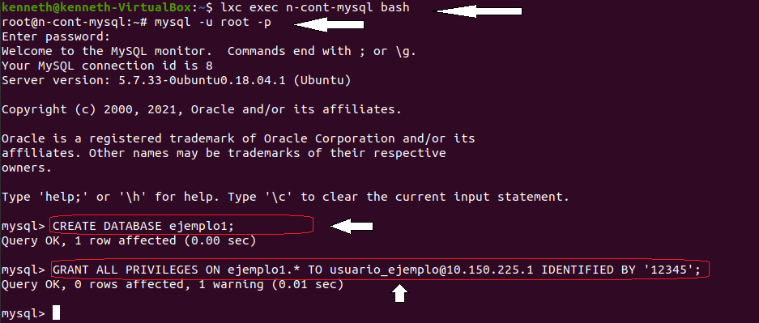
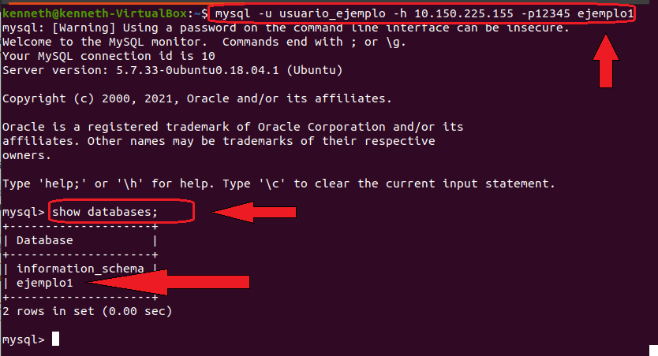

# LXC/LXD con MySQL

Esta carpeta contiene el paso a paso para acceder al servidor MySQL en un ambiente LXC/LXD

Ejecutar sobre una versión de kernel de linux 5.10.19

## Configuracion inicial

- Una vez se tenga instalado LXC y LXD y se inicie el comando `sudo lxd init` se recomienda dejar las configuraciones por defecto.
- Es importante que se intale el servidor `MySQL` en el host de la maquina donde trabaje. Para ello puede utilizar el comando:
- Instalar MySQL: `sudo apt install mysql-server `

## Procedimiento

### 1) Creacion de un nuevo contenedor (LXC) e implementar `MySQL`.

**Descripcion:** Para implementar `MySQL`, se toma como ejemplo la version `ubuntu:18.04` , y el contenedor se denota con el nombre `n-cont-mysql`, este nombre varia segun el gusto del programador.

- Crear contenedor : `lxc launch ubuntu:18.04 n-cont-mysql`

### 2) Instalar dentro del contenedor , MySQL:

**Descripcion:** se debe Iniciar sesion sobre el contenedor creado, que para el ejemplo es **(n-cont-mysql)**, y se debe instalar el servidor **MySQL**, finalmente se inicia el servicio MySQL, y se verifica el estado.

- Abrir contenedor : `lxc exec n-cont-mysql bash`

- Actualizacion en contenedor: `sudo apt update `

- Instalar MySQL en contenedor: `sudo apt install mysql-server`

- Iniciar servicio MySQL: `systemctl start mysql`

- Verifique estado del servicio MySQ: `systemctl status mysql`

  - Se obtiene lo siguiente:



### 3) Aceptacion de conexión en todas las interfaces de red:

**Descripción:** Para que el servidor acepte conexiones de equipos remotos convendrá substituir dentro de las configuraciones del MySQL el `bind-address` cambiando de `127.0.0.1` por `0.0.0.0` para que el servidor abra un puerto en todas las interfaces de red.

- Ubicarse dentro del contenedor creado con MySQL: `lxc exec n-cont-mysql bash`

- valide y compruebe las direcciones de red : `netstat -plnt`

  - Si no ha configurado aun el acceso remoto, se tiene lo siguiente:

  

- Configurar el acceso remoto, abro **mysqld.cnf**, para configurar los cambio deseados: ` vi /etc/mysql/mysql.conf.d/mysqld.cnf`

  - Cambio de _bind-address_ de _127.0.0.1 por 0.0.0.0_

  

- Reinicie _MySQL_, para que se apliquen los cambios: `systemctl restart mysql`

  - Si no se aplican cambios pare `systemctl stop mysql` y luego aplique `systemctl restart mysql`

- valide y compruebe las direcciones de red nuevamente: `netstat -plnt`

  - Si hizo los cambios debe tener lo siguiente:

  

### 4) Obtener la ip del host y contenedor para hacer la comunicación:

**Descripción:** para obtener la direccion del Host se debe direccionar a la terminal principal (**terminal Host o anfitrion**), y para obtener la **ip** del contenedor se puede encontrar de dos formas: ingresando al contenedor (**contenedor del ejemplo: _n-cont-mysql_**)y desde la terminal hallar los datos , o la opcion 2 es desde la terminal del anfitrion, desde donde se creo el contenedor.

- Obtener la ip del Host , `ifconfig`

  

- Obtener la ip del contenedor con MySQL:

  - Desde la terminal del contenedor : `ifconfig`
  - Desde el host, con el comando: `lxc list`

  

### 5) Creando una BBDD,para el flujo de informacion desde el MySQL, creado en el contenedor, hacia el host:

---

### 5.1 Posicionarse en el contenedor y entrar al servidor mysql para configurar los accesos:

- Abrir contenedor : `lxc exec n-cont-mysql bash`

- Entrar al servidor MySQL: `mysql -u root -p`

  - Dentro del servidor MySQL, crear un nueva nueva base de datos:

    **Descripcion:** Una vez dentro del servidor, se crea una nueva base, donde el nombre `ejemplo1` puede variar a gusto del programador:

    ```
    mysql> CREATE DATABASE ejemplo1;
    ```

  - Asigno todos los privilegios a quien tendra acceso a la BBDD `ejemplo1` , que fue creada:

    **Descripcion:** se crea un nombre de usuario y una clave (puede variar a gusto del programador), el cual sera quien puede acceder a la BBDD, asi pues para el ejemplo el usuario :`usuario_ejemplo`, y la clave: `'12345'` , y el número ip: `10.150.225.1` correspondiente al Host, que es desde donde se accesa.

    ```
    mysql> GRANT ALL PRIVILEGES ON ejemplo1.\* TO usuario_ejemplo@10.150.225.1 IDENTIFIED BY '12345';
    ```

  - Si realizó el proceso se deberia mirar como lo siguiente:



### 5.2) Posicionarse en el Host para accceder al servidor MySQL, dentro del contenedor, para poder ver la base de datos `ejemplo1` creada , en paso [5.1](#51-posicionarse-en-el-contenedor-y-entrar-al-servidor-mysql-para-configurar-los-accesos)

**Descripcion:** Desde el Host, se accede a la base BBDD, para ello se debe tener presente el usuario y contraseña creadas en [5.1](#51-posicionarse-en-el-contenedor-y-entrar-al-servidor-mysql-para-configurar-los-accesos), asi pues usuario: `usuario_ejemplo ` , contraseñ: `12345`, y la direccion del contenedor donde se creó BBDD es decir la direccion **ip** del contendor : `10.150.225.155` :

- Accedo al servicio de MySQL dentro del contenedor: `mysql -u usuario_ejemplo -h 10.150.225.155 -p12345 ejemplo1`

- Visualizar base de datos creada:

  ```
  mysql> show databases
  ```

  - se deberia tener algo como lo siguiente


